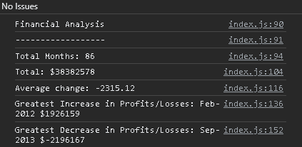

# Console Finances

## Table of contents

- [Overview](#overview)
  - [The challenge](#the-challenge)
  - [Results](#results)
  - [Website](#website)
- [My process](#my-process)
  - [Built with](#built-with)
  - [What I learnt](#what-i-learnt)

## Overview

### The challenge
This project is to analyse financial records of a company with a given dataset: Date and Profit/Losses. I calculate the total number of months in the dataset, the total amount of profit/losses over the entire period, the average of the changes in profit/losses over the entire period, and the greatest increase and greatest decrease in profit/losses. This challenge allows me to practise JavaScript concepts learnt in the front-end web development bootcamp, and apply it to a real-world situation. 

### Results
The following analysis is shown below:
```
Financial Analysis 
----------------
Total Months: 86
Total: $38382578
Average Change: -2315.12
Greatest Increase in Profits/Losses: Feb-2012 $1926159
Greatest Decrease in Profits/Losses: Sep-2013 $-2196167
```
This is a screenshot of the results in the console:



### Website
Deployed application: https://yvonne0711.github.io/console-finances/ 

## My process

### Built with
- JavaScript

### What I learnt
- My instructor helped a lot with the logic and pseudocode by going through a similar example in class
- A lot more comfortable with the logical process and using pseudocode to enable that mindset
- Stack Overflow helped with [rounding to two decimal places](https://stackoverflow.com/questions/11832914/how-to-round-to-at-most-2-decimal-places-if-necessary) using the function `Math.round` function. In this project, I didn't use `Number.EPSILON` as the result was as expected but I will use it when necessary 
- When finding the greatest increase in profits/losses, I originally thought to create an empty array and [incremently append](https://www.samanthaming.com/tidbits/87-5-ways-to-append-item-to-array/) all the values of profits/losses as I didn't have an array of all the values, but I realised the `for` loop is already incrementing through the array by calculating the current `changeinProfit` in the dataset
- Quite a straightforward project with the expected outcome helping check my answers